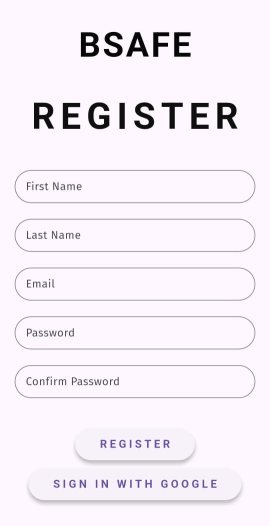

# Women Safety Application

 

A mobile application built using **Flutter**, aimed at improving women's safety through features like emergency alerts, real-time location sharing, and instant contact with trusted individuals.

---

## 🚀 Features

- 📍 **Live Location Tracking**
  - Share your real-time location with trusted contacts.
- 🆘 **SOS Alert Button**
  - Send an emergency message with GPS location in one tap.
- 📞 **Quick Dial Functionality**
  - Access emergency numbers or close contacts quickly.
- 🛡️ **Safe UI Design**
  - Easy to use under stress or in emergency situations.
- 🔒 **Privacy-Focused**
  - Your data stays private unless shared with your consent.

---

## 🛠️ Tech Stack

- **Flutter** – UI Framework
- **Dart** – Backend Logic
- **Google Maps API** – Real-time location services
- **Firebase** – For push notifications, user auth, or database
- **Android SDK** – App testing and deployment

---

## 📷 Screenshots

| Home Screen | SOS Feature | Live Location |
|-------------|-------------|----------------|
|  |  |  |


| Emergency Screen | Contacts Screen| Register Screen | Profile Screen |
|-------------|-------------|----------------|----------------|
|  |  |  |  |

---

## 📦 Getting Started

To run this project on your machine, follow the steps below.

### 🔧 Prerequisites

- Flutter SDK installed: [Flutter Installation Guide](https://docs.flutter.dev/get-started/install)
- A code editor (like VS Code or Android Studio)
- Git
- An Android device or emulator for testing
- Google Maps API key for location features

---

### 🚀 Installation Steps

```bash
# 1. Clone the repository
git clone https://github.com/gargiarya1/Women_Safety_Application.git

# 2. Navigate into the project directory
cd Women_Safety_Application

# 3. Install project dependencies
flutter pub get

# 4. Set up Google Maps API key
# Add your key to AndroidManifest.xml if using maps

# 5. Run the app on a connected device or emulator
flutter run
```

---

### 🤝 Contributing

```bash
# Fork the repository

# Create a new branch
git checkout -b feature/your-feature-name

# Make your changes

# Commit and push
git commit -m "Add your message"
git push origin feature/your-feature-name

# Open a Pull Request 🚀
